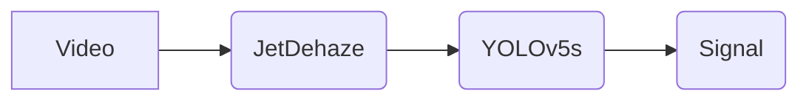

# Wiper 🚗️☔️

>악천후 환경에서 자율주행 시스템의 인식 정확도와 대응 능력을 향상시키기 위한 경량화 기술 개발 프로젝트

# 프로젝트 개요

## 프로젝트 소개

* 악천후(안개) 상황에서 자율주행 인식 성능 저하 문제 해결
* 경량화된 디헤이징 모델 및 객체 인식 모델을 활용한 실시간 제어 시스템 개발

### 프로젝트 목표

* 안개 환경에서도 빠른 객체 인식과 높은 인식 정확도 확보
* Edge 환경에서 실시간 제어 가능

### 주요 기능

* 안개 제거(디헤이징)
* 객체 인식
* 인식 결과 기반 제어 신호 생성

### 활용 분야

* 자율주행 자동차 시스템

--- 
# 프로젝트 아키텍쳐 (Project Architecture)

> 전체 구조 다이어그램 및 흐름도는 추후 삽입 예정



* **Input:** 안개 낀 주행 영상
* **Process 1:** 디헤이징 모델(JetDehaze) → 프레임에 디헤이징 적용
* **Process 2:** 디헤이징 처리된 프레임 → 객체 인식 모델(TensorRT 기반의 yolov5s) → 탐지 결과 생성
* **Process 3:** 객체 탐지된 결과 → **제어 시스템** → 탐지 결과 기반 제어 신호 생성

---

# 🔧 주요 기술

## 1️⃣ 디헤이징 모델

* 자체 개발 모델 (AODNet 변형 기반)
* 실시간 추론 가능하도록 모델 경량화 수행

## 2️⃣ 객체 인식 모델

* YOLOv5s 사용
* .pt → ONNX → TensorRT Engine 변환 수행
* FP16 최적화 적용

## 3️⃣ 제어 처리

* 객체 인식 결과를 기반으로 한 제어 신호 생성 로직 구현

---

# 핵심 구현 내용

## 필요 구현

### 1. 디헤이징 모델 개발 및 개선 

* 기존 디헤이징 모델들의 attention block과 multiscale block 간소화
* 기존 대비 PSNR/SSIM 유지하며 추론 속도 3배 이상 개선

### 2. YOLOv5s 모델 추론 최적화

* **모델 최적화**: `export.py`를 통해 `yolov5s.pt`를 `ONNX`로 변환하고, `trtexec`으로 FP16 기반 TensorRT Engine을 컴파일하여 GPU 가속 및 추론 성능, 메모리 효율을 극대화
* **성능 검증**: 최적화된 모델의 FPS, 추론 시간, 정밀도(mAP), 리소스 사용량(/RAM/GPU 메모리) 등 핵심 지표 측정을 통해 명확한 성능 개선 효과를 입증

### 3. 객체 인식 결과 기반 제어 시스템 구현

* 객체 인식 → 객체 좌표/종류 → 제어 명령 생성
* 예: "사람 또는 자동차 감지" → "정지 명령"
* 흐름도 및 예시 결과 추후 삽입 예정

---

# 장비 및 개발환경

## `Jetson Orin Nano Developer Kit (8GB) `
| 항목            | 사양 (Jetson Orin Nano 8GB)                                |
| :-------------- | :--------------------------------------------------------- |
| **AI 성능** | 40 TOPS (INT8)                                                |
| **GPU** | 1024-core NVIDIA Ampere 아키텍처 GPU (32 Tensor 코어)              |
| **CPU** | 6-core Arm Cortex-A78AE v8.2 64-bit CPU (최대 1.5 GHz)            |
| **메모리** | 8GB 128-bit LPDDR5 (68 GB/s 대역폭)                            |
| **전력 소비** | 7W - 15W                                                   |

## 개발 환경
* **운영체제** : `Ubuntu 20.04 (NVIDIA JetPack 5.1.2)`
* **개발 언어** : `Python 3.8.10`
* **주요 라이브러리 및 프레임 워크**:
  * PyTorch **2.1.0 (L4T)**
  * TorchVision **0.16.0**
  * CUDA **11.4**
  * cuDNN **8.6.0**
  * OpenCV **4.11.0**
  * TensorRT **8.5.2 (CUDA 11.4)**
* **스크립트**: Shell Script

---

# 성능 평가

## 디헤이징 개선 결과
 

| model | avg SSIM |  avg PSNR (dB) | total_time | avg_time | avg_cpu_mem | avg_ram_mem (%) |  avg_gpu_mem (MB) | 
| ----- | -------- | -------------- | ---------- | -------- | ----------- | --------------- |  ---------------- |
| AOD-net | 0.8911 | 20.3           | 3.97       | 0.03     | 3209.73     |  53.55          | 6.7               |
| **JetDehaze (ours)** | 0.9065 | 20.65           | 5.97       | 0.05     | 3239.65     |  80.31          | 7.2      |
| MSBND | 0.8907 | 20.15           | 28.9       | 0.23     | 3293.72     |  62.13          | 127.28               |
| FFA | 0.912 | 20.80           | 199.74       | 1.56     | 3147.75     |  82.45          | 23.86               |

**PSNR (Peak Signal-to-Noise Ratio)** : 이미지 품질 측정에 사용되는 지표로, 값이 높을수록 원본 이미지에 가깝고 노이즈가 적음을 의미합니다.   
**SSIM (Structural Similarity Index Measure)**: 이미지의 구조적 유사성을 평가하는 지표로, 값이 높을수록 두 이미지 간의 유사성이 높음을 의미합니다.

## 객체 인식 개선 결과


| model           | FPS          | Inference Time(ms) | Precision | mAP@0.5      |
|---------------|-----------|------------------|------------------|--------------|
| pt model  (FP16)   | 20.32       | 51.07              | 0.715     | 0.7079       |
| engine model (FP16) | 63.08       | 9.62               | 0.6799    | 0.7087       |
| 성능 변화            | +210.5% ⬆️  | -81.2% ⬆️   | -4.91% ⬇️ | +0.11%  동일 |

---

# 데모 및 결과

pt vs engine: [pt 비교 영상](https://www.youtube.com/shorts/BWZi6F-8AA0)   

pt_FP16 vs engine: [FP16 비교 영상](https://www.youtube.com/shorts/BWZi6F-8AA0)

---

# 라이선스

* [MIT License](LICENSE)

---

# 설치 방법 및 실행 가이드 
이 프로젝트를 로컬 환경(Jetson)에 설정하고 실행하는 방법은 다음과 같습니다.   

## 1. 환경 설정 
프로젝트에 필요한 Python 패키지 및 라이브러리는 `requirements.txt` 파일에 명시되어 있습니다. 아래 절차를 따라 환경을 설정해 주세요.


0. **Environment Setting for Docker Container**(env: NVIDIA's Jetson Orin Nano Developer Kit)   
   docker image: [링크](https://hub.docker.com/repository/docker/wldhks1959/jetson_yolov5_custom/general)   

2. **레포지토리 클론**
    ```bash
    git clone https://github.com/snSon/Wiper.git
    cd Wiper
    ```
3. **의존성 설치**   
   `requirements.txt` 파일을 사용하여 필요한 모든 Python 패키지를 설치합니다.
     ```bash
    pip install -r requirements.txt
    ```

## 2. 입력 영상 다운로드
테스트할 영상을 제공합니다. 다음 경로에 아래 스크립트를 실행하여 동영상을 다운로드하세요.
```bash
cd Wiper/processing/object_detection/custom_yolov5/scripts
./download_resources.sh
```

## 3. 객체 인식 모델 변환
기본 제공되는 yolov5s.pt 모델을 ONNX 및 engine 모델로 변환해야 합니다. 다음 경로에 아래 스크립트를 실행하여 모델을 변환시킬 수 있습니다.
```bash
cd Wiper/processing/object_detection/custom_yolov5/scripts
./convert_model.sh
```

## 4. 디헤이징 + 객체 인식 실행
이를 수행하기 전, 2번 과정을 꼭 수행해야 합니다. 또는 본인이 원하는 동영상을 넣어도 테스트 가능합니다. 단 test_detect.sh 스크립트를 수정해야 합니다.

`test_detect.sh` 일부 중 test_drive_30.mp4를 다른 영상으로 대체 가능
```
...
VIDEO_PATH="$ROOT_DIR/videos/test_drive_30.mp4"
...
```
`[디헤이징 + 객체 인식] 수행`
```bash
cd Wiper/processing/object_detection/custom_yolov5/scripts
./test_detect.sh
```
위 스크립트를 수행하게 되면, custom_yolov5/runs/test_detect/ 아래에 수행 결과가 기록됩니다.
## 5. 제어 신호 생성
- `제어 신호 팀이 추가해야 합니다.`

# 기타
## 향후 계획 및 확장 방향
1. **디헤이징 모델 성능 최적화**: 현재 디헤이징 모델을 추가적으로 개선하여, 더욱 향상된 영상 품질과 함께 **완전한 실시간 추론 성능을 확보**하는 것을 목표로 합니다.
2. **통합 제어 시스템 개발**: 현재는 분리된 프로세스로 동작하는 객체 인식 결과 기반 제어 신호 생성 부분을 전체 시스템에 완전히 병합하여, 단일 파이프라인으로 **일관성 있는 실시간 동작이 가능**하도록 구현할 예정입니다.

## 기여자 목록 및 Github 주소
| 이름     | GitHub 주소                                 |
|----------|--------------------------------------------|
| 박준현   | [https://github.com/p-jh0](https://github.com/p-jh0)           |
| 서지완   | [https://github.com/wldhks1959](https://github.com/wldhks1959) |
| 손주석   | [https://github.com/snSon](https://github.com/snSon)           |
| 이준영   | [https://github.com/jun-yeong1](https://github.com/jun-yeong1) |
| 이재웅   | [https://github.com/pgjaeung](https://github.com/pgjaeung)     |
| 최창욱   | [https://github.com/ourwater5287](https://github.com/ourwater5287) |