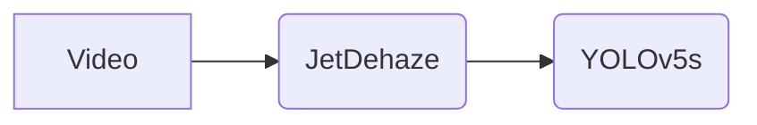

# 1\. Wiper 🚗️☔️

> 악천후 환경에서 자율주행 시스템의 인식 정확도와 대응 능력을 향상시키기 위한 경량화 기술 개발 프로젝트

# 2\. 프로젝트 개요

## 2.1. 프로젝트 소개

  * 악천후(안개) 상황에서 자율주행 인식 성능 저하 문제 해결
  * 경량화된 디헤이징 모델 및 객체 인식 모델을 활용한 실시간 제어 시스템 개발

### 2.1.1. 프로젝트 목표

  * 안개 환경에서도 빠른 객체 인식과 높은 인식 정확도 확보
  * Edge Device 환경에서 실시간 객체 탐지 가능

### 2.1.2. 주요 기능

  * 안개 제거(디헤이징)
  * 객체 인식

### 2.1.3. 활용 분야

  * 자율주행 자동차 시스템
  * 해안가 감시 시스템

-----

# 3\. 장비 및 개발환경

## 3.1. Jetson Orin Nano Developer Kit (8GB)

| 항목 | 사양 (Jetson Orin Nano 8GB) |
| :--- | :--- |
| **AI 성능** | 40 TOPS (INT8) |
| **GPU** | 1024-core NVIDIA Ampere 아키텍처 GPU (32 Tensor 코어) |
| **CPU** | 6-core Arm Cortex-A78AE v8.2 64-bit CPU (최대 1.5 GHz) |
| **메모리** | 8GB 128-bit LPDDR5 (68 GB/s 대역폭) |
| **전력 소비** | 7W - 15W |

## 3.2. 개발 환경

  * **운영체제** : Ubuntu 20.04 (NVIDIA JetPack 5.1.2)
  * **개발 언어** : Python 3.8.10
  * **주요 라이브러리 및 프레임 워크**:
      * PyTorch **2.1.0 (L4T)**
      * TorchVision **0.16.0**
      * CUDA **11.4**
      * cuDNN **8.6.0**
      * OpenCV **4.11.0**
      * TensorRT **8.5.2 (CUDA 11.4)**
  * **스크립트**: Shell Script

-----

# 4\. 프로젝트 아키텍쳐 (Project Architecture)

> 전체 구조 다이어그램 및 흐름도는 추후 삽입 예정



  * **Input:** 안개 낀 주행 영상
  * **Process 1:** 디헤이징 모델(JetDehaze) → 프레임에 디헤이징 적용
  * **Process 2:** 디헤이징 처리된 프레임 → 객체 인식 모델(TensorRT 기반의 yolov5s) → 탐지 결과 생성

-----

# 5\. 🔧 주요 기술

## 5.1. 디헤이징 모델

  * 자체 개발 모델 (AODNet 변형 기반)
  * 실시간 추론 가능하도록 모델 경량화 수행

## 5.2. 객체 인식 모델

  * YOLOv5s 사용
  * .pt → ONNX → TensorRT Engine 변환 수행
  * FP16 최적화 적용

-----

# 6\. 핵심 구현 내용

## 6.1. 필요 구현

### 6.1.1. 디헤이징 모델 개발 및 개선

  * 기존 디헤이징 모델들의 attention block과 multiscale block 간소화
  * 기존 대비 PSNR/SSIM 유지하며 추론 속도 3배 이상 개선

### 6.1.2. YOLOv5s 모델 추론 최적화

  * **모델 최적화**: `export.py`를 통해 `yolov5s.pt`를 ONNX로 변환 후, FP16 기반 `TensorRT Engine`을 컴파일하여 GPU 가속 및 추론 성능, 메모리 효율을 극대화
  * **성능 검증**: 최적화된 모델의 FPS, 추론 시간, 정밀도(mAP), 리소스 사용량(/RAM/GPU 메모리) 등 핵심 지표 측정을 통해 명확한 성능 개선 효과를 입증

-----

# 7\. 성능 평가

## 7.1. 디헤이징 개선 결과

| model | SSIM | PSNR | Inference Time |
| :--- | :--- | :--- | :--- |
| AOD-Net | 0.9127 | 21.7008 | 20 |
| MSBDN | 0.9137 | 22.9295 | 30 |
| **JetDehaze (ours)** | 0.9154 | 23.8489 | 480 |
| FFA-Net | 0.9184 | 24.2713 | 1310 |

  * Training Dataset : RESIDE-Standard(ITS)
  * Test Dataset : RESIDE-Standard(SOTS)

**PSNR (Peak Signal-to-Noise Ratio)** : 이미지 품질 측정에 사용되는 지표로, 값이 높을수록 원본 이미지에 가깝고 노이즈가 적음을 의미합니다.  
**SSIM (Structural Similarity Index Measure)**: 이미지의 구조적 유사성을 평가하는 지표로, 값이 높을수록 두 이미지 간의 유사성이 높음을 의미합니다.

## 7.2. 객체 인식 개선 결과

| model (FP16)| FPS | Inference Time | Precision | Recall | mAP@0.5 |
| :--- | :--- | :--- | :--- | :--- | :--- |
| pt | 28.93 | 28.44 | 0.67 | 0.52 | 0.57 |
| **engine** | 63.71 | 9.63 | 0.67 | 0.52 | 0.57 |

# 8\. 데모 및 결과

pt vs engine: [pt 비교 영상](https://www.youtube.com/shorts/BWZi6F-8AA0)

pt\_FP16 vs engine: [FP16 비교 영상](https://www.youtube.com/shorts/BWZi6F-8AA0)

-----

# 9\. 라이선스

  * MIT License

-----

# 10\. 설치 방법 및 실행 가이드

이 프로젝트를 로컬 환경(Jetson)에 설정하고 실행하는 방법은 다음과 같습니다.

## 10.1. 환경 설정

프로젝트에 필요한 Python 패키지 및 라이브러리는 requirements.txt 파일에 명시되어 있습니다. 아래 절차를 따라 환경을 설정해 주세요.

0.  **Environment Setting for Docker Container**(env: NVIDIA's Jetson Orin Nano Developer Kit)
    docker image: [링크](https://hub.docker.com/repository/docker/wldhks1959/jetson_yolov5_custom/general)

1.  **레포지토리 클론**
    
     ```bash
    git clone https://github.com/snSon/Wiper.git
    cd Wiper
    ```

2.  **의존성 설치**
    requirements.txt 파일을 사용하여 필요한 모든 Python 패키지를 설치합니다.  
      ```bash
    pip install -r requirements.txt
    ```
    

## 10.2. 입력 영상 다운로드

테스트할 영상을 제공합니다. 다음 경로의 스크립트를 실행하여 동영상을 다운로드하세요.

```bash
cd Wiper/processing/object_detection/custom_yolov5/scripts
./download_resources.sh
```

## 10.3. 객체 인식 모델 변환

기본 제공되는 yolov5s.pt 모델을 ONNX 및 engine 모델로 변환해야 합니다. 다음 경로에 아래 스크립트를 실행하여 모델을 변환시킬 수 있습니다.

```bash
cd Wiper/processing/object_detection/custom_yolov5/scripts
./convert_model.sh
```

## 10.4. 디헤이징 + 객체 인식 실행

이를 수행하기 전, `10.2` 과정을 꼭 수행해야 합니다. 만약 본인이 소유한 다른 동영상으로 테스트하려면, `test_detect.sh` 스크립트 내부의 `VIDEO_PATH` 변수를 수정해야 합니다.


`test_detect.sh` 파일 일부 :
```
...
# 아래 경로를 테스트하려는 영상의 경로로 수정하세요.
VIDEO_PATH="$ROOT_DIR/videos/test_drive_30.mp4"
...
```
준비가 완료되면 `[디헤이징 + 객체 인식]`을 수행합니다.
```bash
cd Wiper/processing/object_detection/custom_yolov5/scripts
./test_detect.sh
```
위 스크립트를 수행하게 되면, `custom_yolov5/runs/test_detect/` 아래에 수행 결과가 기록됩니다.

# 11\. 향후 계획 및 기여자

## 11.1. 향후 계획

1.  **디헤이징 모델 성능 최적화**: 현재 디헤이징 모델을 추가적으로 개선하여, 더욱 향상된 영상 품질과 함께 **완전한 실시간 추론 성능을 확보**하는 것을 목표로 합니다.
2.  **통합 제어 시스템 개발**: 현재는 분리된 프로세스로 동작하는 객체 인식 결과 기반 제어 신호 생성 부분을 전체 시스템에 완전히 병합하여, 단일 파이프라인으로 **일관성 있는 실시간 동작이 가능**하도록 구현할 예정입니다.

## 11.2. 기여자 목록 및 Github 주소

| 이름 | GitHub 주소 |
| :--- | :--- |
| 박준현 | [https://github.com/p-jh0](https://github.com/p-jh0) |
| 서지완 | [https://github.com/wldhks1959](https://github.com/wldhks1959) |
| 손주석 | [https://github.com/snSon](https://github.com/snSon) |
| 이준영 | [https://github.com/jun-yeong1](https://github.com/jun-yeong1) |
| 이재웅 | [https://github.com/pgjaeung](https://github.com/pgjaeung) |
| 최창욱 | [https://github.com/ourwater5](https://github.com/ourwater5) |