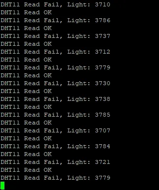

# 4/4 DHT11 센서 통신 실패 분석 및 개선

---

# DHT11 센서 통신 실패 분석 및 개선 보고서

## 테스트 개요

- **목표**: STM32F446RE 보드에서 DHT11 온습도 센서를 FreeRTOS 환경 하에 연결, 1초마다 온습도 데이터를 UART를 통해 송출.
- **환경**
    - MCU: STM32F446RE
    - 센서: DHT11 (3핀 타입)
    - 통신: GPIO 입력을 통한 타이밍 기반 통신
    - 디버깅: UART 시리얼 로그 출력, Bit duration 측정
    - RTOS: FreeRTOS

---

## 진행 내용 및 문제 해결 시도

### 1. 문제 발생 현상

- `DHT11 Read Fail`, `Step2 Fail: No HIGH from DHT` 로그 다수
    
    
    
- `Bit[x][y] = xx us` 비트 수신 지속시간 불안정
- 일부는 `Read OK`이나, 전체 값 수신 실패
- `Checksum Fail` 발생 빈번

### 2. 코드 최적화 및 디버깅

- GPIO 입력 방식 → `HAL_GPIO_ReadPin()` 대신 레지스터 직접 접근 사용
    
    ```c
    #define DHT11_INPUT() ((DHT11_PORT->IDR & DHT11_PIN) ? GPIO_PIN_SET : GPIO_PIN_RESET)
    ```
    
- 타이머 정밀도 확인 (`delay_us()` 1us 단위 정확하게 동작)
- 각 비트 수신 지속시간 UART로 출력 (최대 5바이트, 40bit 전체 분석)
    
    ```c
    sprintf(msg, "Bit[%d][%d] = %lu us (%d)\r\n", j, i, t_duration, (t_duration >= 45));
    ```
    

### 3. 하드웨어 변경 및 개선 시도

| 시도 | 내용 | 결과 |
| --- | --- | --- |
| 풀업 저항 추가 | 10kΩ, 4.7kΩ 저항 DATA-VCC 연결 | 소폭 개선 |
| 분압 회로 구성 | 10kΩ + 220Ω (DATA → STM32) | 과전압 방지, 일부 안정화 |
| 전원 변경 | 3.3V → 5V (공급), DATA는 분압으로 3.3V 수준 | 개선됨 |
| 브레드보드 제거 | 브레드보드 간섭 제거, 점퍼선 직결 | 미미한 효과 |
| 타이밍 조정 | start signal 길이 18ms → 22ms, timeout 증가 | 일시적 개선 |

---

## 결론 및 향후 방향

- **문제 원인**: DHT11 통신 실패의 주요 원인은 하드웨어적 신호 불안정(전압 강하, 풀업 부족, 신호 잡음)으로 판단됨
- **중간 결론**:
    - 코드 타이밍, 논리에는 큰 문제 없음
    - 지속시간 기준과 Read 방식은 적절히 구성됨
- **필수 조건**
    1. DHT11에 **5V 공급 + 풀업 저항(4.7kΩ)** 적용
    2. **DATA ↔ STM32 핀 간 분압 회로(10kΩ+220Ω)** 구성
    3. 브레드보드 제거, 짧은 점퍼선으로 직접 연결
- **향후 조치**
    - 센서 교체 테스트 권장 (DHT11은 개체 간 편차 매우 큼)
    - 보다 정밀한 센서(DHT22 온습도 센서) 고려