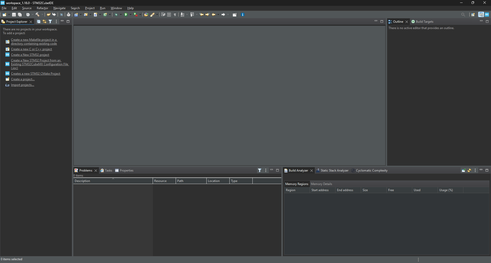

# STM32 보드 테스트

## 작업 설명

- STM32F446RE 보드 기반 테스팅
- STM32CubeIDE를 활용
    - 프로젝트 생성 및 빌드
    - 3초마다 Hello라는 글자 출력하기
- putty를 활용하여 시리얼 모니터 출력 확인하기

# STM32CubeIDE 설치 및 테스트하기(LED 점등)



STM32CubeIDE를 설치하고 실행하면 이런 화면일 것이다. 

아래 화면에서 File → New → STM32 Project를 클릭한다.


그리고 우리가 사용하는 보드인 STM32FF446RE를 검색창에 입력하고 Next를 누른다.


MCU_Test라는 이름으로 프로젝트를 생성한다.


Pinout & Configuration 탭에서 FREERTOS를 클릭 후 Interface를 CMSIS_V1 또는 CMSIS_V2를 선택한다.


그 후, ctrl + s 를 누르면 Warnings 화면이 나오지만 무시하고 Yes를 누르면 된다.

그러면 아래와 같은 파일 트리들이 생성될 것이다.


우리는 현재 STM32 보드에 올릴 코드를 작성하고, 빌드 후 업로드하여 제대로 동작하는지 확인하고 싶다. 

그래서 main.c 파일 또는 freertos.c에  StartDefaultTask() 함수를 수정할 것이다. 

```c
void StartDefaultTask(void const * argument)
{
  /* USER CODE BEGIN 5 */
  /* Infinite loop */
  for(;;)
  {
    osDelay(1);
  }
  /* USER CODE END 5 */
}
```

기본적으로 위와 같이 초기화되어 있다. 

보드에 설치되어 있는 기본 LED를 1초마다 깜빡이는 코드를 만들어보겠다.

```c
void StartDefaultTask(void const * argument)
{
  /* USER CODE BEGIN StartDefaultTask */
  /* Infinite loop */
	 for(;;)
	  {
	    HAL_GPIO_WritePin(GPIOA, GPIO_PIN_5, GPIO_PIN_SET); // LED ON
	    osDelay(500); // 0.5초 켜짐

	    HAL_GPIO_WritePin(GPIOA, GPIO_PIN_5, GPIO_PIN_RESET); // LED OFF
	    osDelay(500); // 0.5초 꺼짐

	    // 총 1초 주기로 깜빡임
	  }
  /* USER CODE END StartDefaultTask */
}
```

위와 같이 입력하면 1초마다 LED가 깜빡여야 한다. 

그러면 어떻게 이 코드를 보드에 적용할 수 있을까? 

먼저 ctrl+b 를 눌러 코드를 빌드하여야 한다. 그러면 아래와 같이 Console 창에 Build Finished라는 메시지가 출력된다. 만약 error가 발생했다면 이전 단계들을 다시 살펴보는 것을 추천한다. 


그럼, 현재 빌드는 완료된 상태이고 보드에 빌드된 파일을 올려기만 하면 된다. 단순히 RUN 버튼을 누르면 된다.


처음 업로드하게 되면, 아래와 같은 화면이 뜰 텐데, 그냥 OK를 누르면 된다.


그러면 아래와 같은 메시지가 출력되면서 업로드가 완료된 것이다.


아래 사진에서 빨간색 박스로 표시한 LED가 1초마다 깜빡이는 것을 확인할 수 있을 것이다.


---

## 테스트2 (시리얼로 문자 출력하기)

자 그럼 이제, 시리얼 모니터로 문자를 출력해볼 것이다. 

3초마다 UART를 통해 Elapsed Time: 3 sec 이라는 메시지를 출력해볼 것이다.

참고로 STM32CubeIDE에는 시리얼 모니터가 없기 때문에, 외부 프로그램을 사용하여야 한다. 여기서는 putty라는 프로그램을 사용할 것이다. 

.ioc 파일을 열어서 USART2 / Asynchronous 선택한다.


**`StartDefaultTask() 함수 수정`**

```c
extern UART_HandleTypeDef huart2; // uart2 setting

void StartDefaultTask(void const * argument)
{
  /* USER CODE BEGIN StartDefaultTask */
	uint32_t seconds = 0;
	char msg[50];

  /* Infinite loop */
	 for(;;)
	  {
		seconds += 3;
		snprintf(msg, sizeof(msg), "Elapsed Time: %lu sec\r\n", seconds);
		HAL_UART_Transmit(&huart2, (uint8_t*)msg, strlen(msg), HAL_MAX_DELAY); // uart print
	    HAL_GPIO_WritePin(GPIOA, GPIO_PIN_5, GPIO_PIN_SET); // LED ON
	    osDelay(1500); // 1.5초 켜짐

	    HAL_GPIO_WritePin(GPIOA, GPIO_PIN_5, GPIO_PIN_RESET); // LED OFF
	    osDelay(1500); // 1.5초 꺼짐
	    // 총 3초 주기로 깜빡임
	  }
  /* USER CODE END StartDefaultTask */
}
```

위 코드를 입력하고 빌드 후, 업로드하면 보드에 업로드된 것이다. LED는 깜빡이는 것을 바로 볼 수 있지만, 시리얼 모니터는 putty로 봐야 한다. putty로 보는 법을 알려주겠다.

먼저 컴퓨터에서 Device manager(장치 관리자)를 실행한다. 실행하게 되면 아래와 같이 화면을 볼 수 있는데, Ports에서 STM~ 라는 port의 COMx에서 x를 기억한다.


내 기준으로는 COM9인 것을 확인할 수 있다. 

그 다음에는 putty라는 프로그램을 실행하고 아래와 같이 표시한 부분을 입력하면 된다.

Save Sessions는 원하는 이름이기 때문에 아무렇게 해도 된다. 

Serial Line에는 아까 장치 관리자에서 확인했던 COM9를 입력했다. 


그 후 Save하고 실행하면 아래와 같은 화면을 볼 수 있게 된다. 즉 시리얼 모니터를 확인할 수 있다.


---

여기까지 UART 통신을 통해 시리얼 모닡터에 숫자를 출력하는 것을 테스트해보았다.
