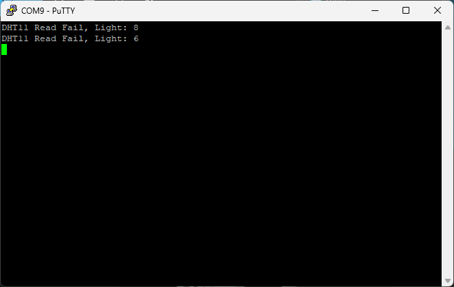
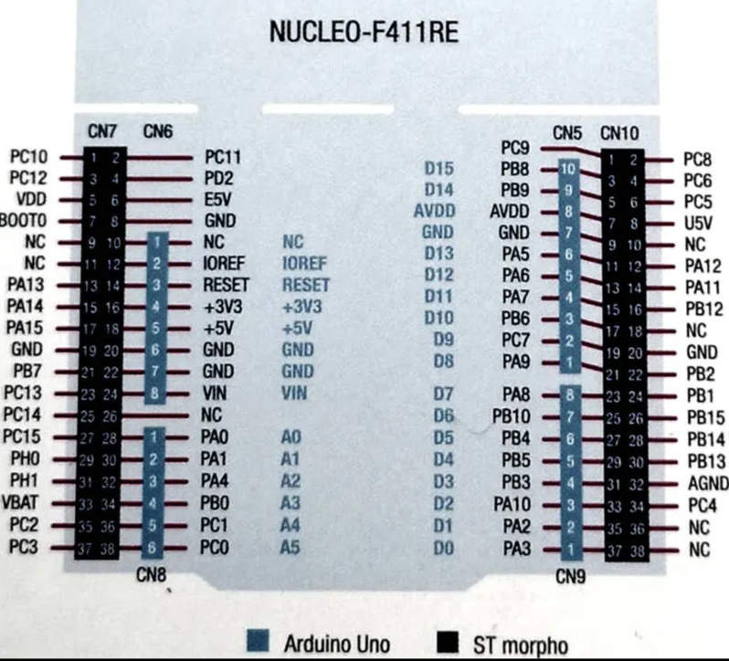

# MCU 기반 조도 습도 센서 테스트 (04/03)

---

## 현 시점 문제 정의

1. 조도 값이 1번만 읽힌다.
2. 조도 값이 10 이하로 작게 나온다.
3. 습도 값을 읽을 수 없다.



- 4/3 테스트
    
    # DHT11 센서 디버깅 및 시스템 설정 보고서
    
    ## ▶️ 프로젝트
    
    - **목표**: STM32F446RE + FreeRTOS 환경에서 DHT11 온습도 센서와 CDS 조도센서를 주기적으로 읽고 UART로 출력한다.
    - **문제 발생**: DHT11 센서가 간헐적으로만 동작하며, FreeRTOS 반복 주기에서 일부 주기에만 값을 읽는다.
    
    ---
    
    ## ▶️ 시스템 구성 요약
    
    ### MCU
    
    - STM32F446RE
    
    ### 센서 및 통신 구성
    
    | 센서 | 연결 핀 | 설명 |
    | --- | --- | --- |
    | DHT11 | PB5 (GPIO Input/Output) | 온습도 데이터 핀 |
    | CDS 조도센서 | MCP3208 CH0 | SPI2 (PB13~PB15 사용) 통해 ADC 값 읽음 |
    
    ### 타이머
    
    - **htim2** 사용: DHT11 마이크로초 단위의 타이밍 체크용
        - Prescaler: 16
        - Period: 0xFFFFFFFF (32bit max)
    
    ### UART
    
    - USART2 (PA2, PA3): 디버깅 메시지 출력용
    
    ### FreeRTOS
    
    - defaultTask: 1초 주기로 DHT11 + CDS 값을 읽고 UART로 출력
    
    ---
    
    ## 주요 문제점
    
    ### 문제 1: DHT11 센서가 간헐적으로만 정상 동작함
    
    ### 문제 2: FreeRTOS loop가 정상가지지만 DHT11 값이 계속 Read Fail
    
    ---
    
    ## 수정 작업
    
    ### 1. `DHT11_WaitForPinState()` 함수 수정
    
    ```
    uint8_t DHT11_WaitForPinState(GPIO_PinState state, uint32_t timeout_us) {
        uint32_t start = __HAL_TIM_GET_COUNTER(&htim2);
        while (HAL_GPIO_ReadPin(DHT11_PORT, DHT11_PIN) != state) {
            uint32_t elapsed = (uint32_t)(__HAL_TIM_GET_COUNTER(&htim2) - start);
            if (elapsed >= timeout_us)
                return 0;
        }
        return 1;
    }
    ```
    
    ### 2. `ReadDHT11()` 함수 내 PIN Output -> Input 가능 시 delay 추가
    
    ```
    HAL_GPIO_WritePin(DHT11_PORT, DHT11_PIN, GPIO_PIN_SET);
    delay_us(30);  // <- 20~30us 정도 지연 추가
    DHT11_SetPinInput();
    ```
    
    ### 3. `delay_us()` 함수 추가 (`sensors.c`)
    
    ```
    void delay_us(uint32_t us)
    {
        uint32_t start = __HAL_TIM_GET_COUNTER(&htim2);
        while ((uint32_t)(__HAL_TIM_GET_COUNTER(&htim2) - start) < us);
    }
    ```
    
    ### 4. `Sensors_Init()` 내 `HAL_TIM_Base_Start(&htim2)` 확인
    
    - `htim2` 타이머가 모두 바로 복구되어야 함
    
    ---
    
    ## 예상되는 결과 (시리얼 출력)
    
    ```
    DHT11 Read OK
    Temp: 23°C, Humi: 55%, Light: 3214
    DHT11 Read OK
    Temp: 23°C, Humi: 55%, Light: 3220
    ...
    ```
    
    ---
    
    ---
    
    ## ▶️ 정보
    
    | 사용 타이머 | 설정 값 |
    | --- | --- |
    | TIM2 Prescaler | 16 |
    | Period (ARR) | 0xFFFFFFFF |
    | Clock source | Internal Clock (APB1 = 16MHz) |
    | TIM2 회전 시간 | 1 tick = 1 us |



- 4/3 MCP3208없이 조도 센서 읽기
    
    ### 📋 **DHT11 + CDS 센서 통합 프로젝트 진행 보고서2**
    
    ### **1. MCP3208 제거**
    
    - SPI를 통한 MCP3208 방식에서 **ADC1을 직접 이용한 방식으로 전환**
    - CDS(조도 센서) 신호는 **PC0(ADC1_IN10)** 핀에 직접 연결
    - 관련 함수 `ReadADC_Channel`, `ReadCDS_2`, SPI 초기화 및 GPIO 설정 제거 완료
    
    ### **2. CDS 센서 연결 변경**
    
    - MCP3208 대신 STM32F446RE의 아날로그 핀 **PC0** 사용
    - CubeIDE에서 **ADC1 활성화**, **IN10(PC0) 채널 선택**
    - HAL 코드로 `HAL_ADC_Start → PollForConversion → GetValue → Stop` 루틴 사용
    
    ### **3. DHT11 센서 설정 및 개선**
    
    - 사용 핀: **PB5**
    - 타이머: **TIM2 1us 단위** 설정
    - DHT11 초기화 시퀀스 개선:
        - 초기 Pull Low: 20us → 적정 값으로 delay 조절 (`delay_us(20)`)
        - Pull High 후 대기 시간: `delay_us(40)`
    - 에러 디버깅 메시지 추가:
        - Step1, Step2 실패 시 UART로 상세 메시지 출력 (`"Step1 Fail: No LOW from DHT"` 등)
    - 타이머 정확도 확인 완료 (`1000178us ±10us 수준`)
    
    ### **4. FreeRTOS 기반 주기적 측정**
    
    - `StartDefaultTask()` 내부 루프에서 1초 주기로 DHT11, CDS 값 측정 및 UART 출력
    - 메시지 형식:
        - `"Temp: %d°C, Humi: %d%%, Light: %d"` 또는
        - `"DHT11 Read Fail, Light: %d"`
    
    ---
    
    ### ⚠️ **현 시점의 주요 이슈**
    
    - DHT11에서 `"Step1 Fail: No LOW from DHT"` 에러 다수 발생
        - 센서와 MCU 간 초기 핸드셰이크가 실패함
    
    ---
